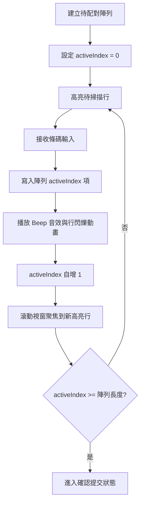

# 掃描槍鍵盤監聽與連續批次輸入規範 (barcode-input-listener-spec)

本技能指導如何在網頁應用程式中優雅地處理實體 USB 條碼掃描槍的輸入。USB 掃描槍在系統中被識別為高速模擬鍵盤輸入，結尾帶有換行符（Enter）。

## ⌨️ 掃描槍監聽的核心邏輯

### 1. 事件防衝突鎖 (Input Lock)
當用戶在輸入文字（例如填寫信箱或備註）時，應**暫停全局掃描槍事件監聽**，以避免掃描槍輸入的條碼與當前打字輸入的字元混雜。

### 2. 鍵盤事件監聽器模板 (React)
```javascript
import React, { useState, useEffect, useRef, useCallback } from 'react';

export function useBarcodeScanner(onScan, enabled = true) {
  const [scanBuffer, setScanBuffer] = useState('');

  useEffect(() => {
    if (!enabled) return;

    const handleKeyDown = (e) => {
      // 1. 如果目前焦點在一般輸入框或下拉選單，則跳過全局監聽，讓原生輸入框處理
      const activeEl = document.activeElement;
      if (activeEl && (activeEl.tagName === 'INPUT' || activeEl.tagName === 'SELECT' || activeEl.tagName === 'TEXTAREA')) {
        // 如果輸入框是唯讀的（例如用於聚焦的隱藏 ghost input），則仍允許掃描
        if (!activeEl.readOnly) return;
      }

      if (e.key === 'Enter') {
        if (scanBuffer.trim()) {
          onScan(scanBuffer.trim());
        }
        setScanBuffer('');
      } else if (e.key.length === 1) {
        setScanBuffer(prev => prev + e.key);
      }
    };

    window.addEventListener('keydown', handleKeyDown);
    return () => window.removeEventListener('keydown', handleKeyDown);
  }, [scanBuffer, onScan, enabled]);
}
```

---

## ⚡ 批次掃描配對 UI/UX 狀態演算法

當需要將多個條碼連續配對至多個目標項目（例如：將 10 張冷氣卡配對至 10 個班級）時，應實作以下狀態控制流程：



### 1. 行程高亮與自動滾動範本 (CSS + JS)
高亮行必須具有視覺提示與動畫（如 `scanPulse` 脈衝陰影），並在焦點跳轉時自動平滑滾動到可視區域中。

```javascript
// 自動滾動到高亮行的 Ref 控制
const activeRowRef = useRef(null);

useEffect(() => {
  if (activeRowRef.current) {
    activeRowRef.current.scrollIntoView({
      behavior: 'smooth',
      block: 'center'
    });
  }
}, [activeIndex]);
```

### 2. 配對音效反饋 (AudioContext Beep)
為了讓操作員不看螢幕也能確認掃描成功，必須在掃描成功時使用瀏覽器內建的 `AudioContext` 播放簡短的高頻嗶聲（BEEP）。

```javascript
const playBeep = () => {
  try {
    const ctx = new (window.AudioContext || window.webkitAudioContext)();
    const osc = ctx.createOscillator();
    const gain = ctx.createGain();
    osc.connect(gain);
    gain.connect(ctx.destination);
    
    osc.frequency.value = 880; // 880Hz 高音
    gain.gain.setValueAtTime(0.2, ctx.currentTime);
    gain.gain.exponentialRampToValueAtTime(0.001, ctx.currentTime + 0.12); // 0.12 秒漸弱
    
    osc.start(ctx.currentTime);
    osc.stop(ctx.currentTime + 0.12);
  } catch (e) {
    console.error("無法播放音效", e);
  }
};
```

---

## 📷 光學掃描物理限制與相機雙軌架構 (Html5Qrcode)

### 1. 物理相容性限制認知
開發條碼系統時必須明確區分兩種掃描情境與硬體限制：
- **傳統雷射 / 紅光一維掃描槍**：依靠發射雷射並接收「紙張反光」解碼。**物理上無法讀取會發光的手機/平板螢幕**（因玻璃反光與液晶刷新率干擾）。
- **2D CMOS 影像掃描槍 / 手機相機**：透過感光元件「拍照」解碼，能順利讀取手機螢幕上的條碼或 QR Code。

### 2. 雙軌備援架構設計
在設計核發或取件系統時，若使用者需要出示手機憑證，**必須**提供以下雙軌機制：
- **實體槍模式**：全局鍵盤監聽（上述 `useBarcodeScanner`），適用於紙本憑證或操作員擁有高階 2D 實體掃描槍。
- **鏡頭相機模式 (Fallback)**：整合 `Html5Qrcode` 相機模組，讓操作員可用手機、平板或 WebCam 直接對準使用者的螢幕掃碼。

### 3. Html5Qrcode 連續掃描回調防護 (Callback Safety)
在使用 `Html5QrcodeScanner` 時，其啟動函式要求傳入兩個回調（Success 與 Failure）。
🚨 **致命陷阱**：相機開啟時，每秒會進行多次（例如 10 幀）解碼嘗試。如果在未掃描到條碼的幀中，系統嘗試呼叫 Failure 回調，而開發者**漏未定義**該函式，將導致拋出 `ReferenceError: onScanFailure is not defined`，進而引發相機模組死機或白畫面。

**標準防護實作**：
```javascript
// 必須實作空的回調，或做靜默處理
function onScanFailure(error) {
    // 通常為了避免干擾，可選擇忽略或輸出 warning
    // console.warn(`Scan attempt failed: ${error}`);
}

function onScanSuccess(decodedText) {
    // 處理掃描成功邏輯
}

// 初始化時，即使不用處理失敗，也嚴禁省略第二個參數！
try {
    const scanner = new Html5QrcodeScanner("reader", { fps: 10, qrbox: 250 }, false);
    scanner.render(onScanSuccess, onScanFailure); // 👈 這裡的 onScanFailure 絕對不能少！
} catch (e) {
    console.error("相機初始化失敗（可能無權限）", e);
}
```
